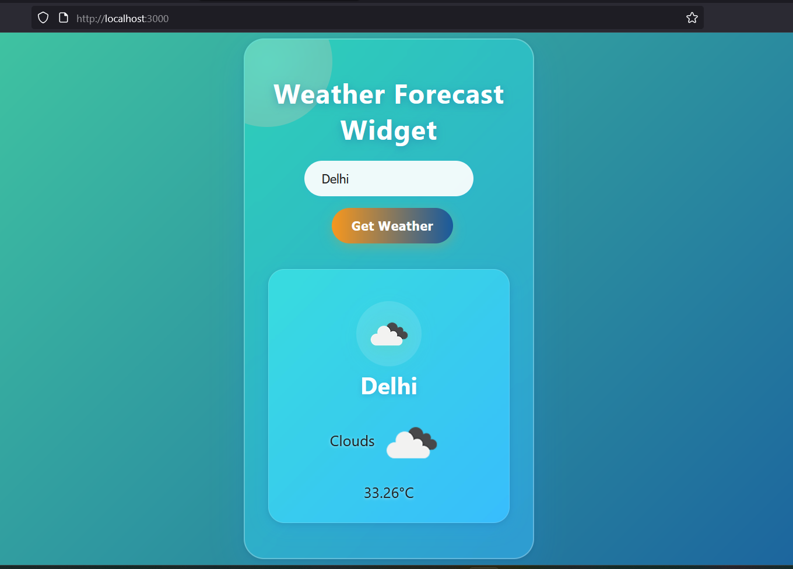

# Weather Widget

A beautiful, responsive weather widget built with React. Instantly fetches and displays real-time weather data for any city using the OpenWeatherMap API.

## ✨ Features

- **Live Weather:** Get current weather for any city worldwide
- **Modern UI:** Vibrant gradients, Glassmorphism, and smooth animations
- **Responsive:** Looks great on mobile, tablet, and desktop
- **Easy to Use:** Simple, intuitive interface

## 🚀 Getting Started

### 1. Clone the repository

```bash
git clone https://github.com/your-username/weather-widget.git
cd weather-widget
```

### 2. Install dependencies

```bash
npm install
```

### 3. Start the development server

```bash
npm start
```

The app will run at [http://localhost:3000](http://localhost:3000).

## 🌦️ API Key

This app uses the [OpenWeatherMap API](https://openweathermap.org/api). The demo key is included for testing, but for production, [get your own API key](https://home.openweathermap.org/users/sign_up) and update the `API_KEY` in `src/App.jsx`.

## 🛠️ Build & Deploy

To create a production build:

```bash
npm run build
```

You can then deploy the `build/` folder to any static hosting service (Vercel, Netlify, GitHub Pages, etc).

## 📁 Project Structure

```
weather-widget/
  ├── public/
  ├── src/
  │   ├── App.jsx
  │   ├── App.css
  │   └── index.js
  ├── package.json
  └── README.md
```

## 📸 Preview



---

**Enjoy your stylish weather widget!**
# Weather-Widget
